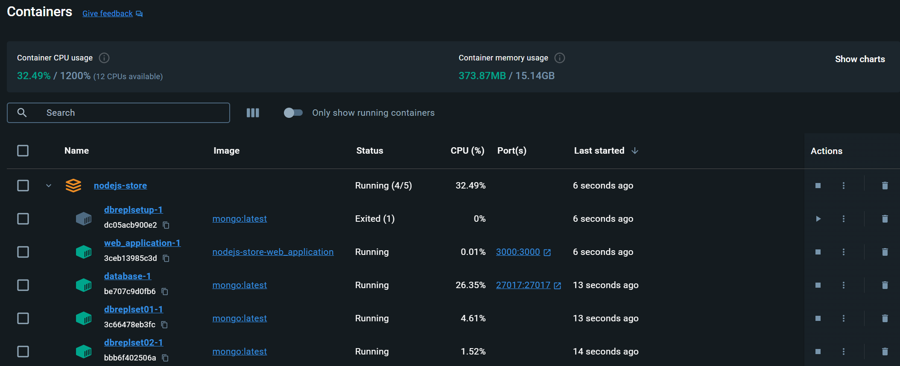

# Node.js Store Application

Full-Stack Store Application Written in Node.js, Express.js, and MongoDB.

Completed in partial fulfillment of the Advanced Database class at UW Green Bay.

# Running the Application

There are two primary ways of running the application &ndash; on bare metal or via the Docker Compose containerization
stack. If you utilize Docker Compose, the necessary database instances, their corresponding replication sets, and the
deployment of the web application itself will be taken care of for you. However, if you do not wish to use Docker
Compose, you may manage your own instance of MongoDB and it's corresponding replication sets at your own discretion. You
can also choose to host certain parts of the application inside Docker Compose (such as the database) while hosting
other parts (such as the web application) on bare metal &ndash; a process which we will cover more in-depth later on.

## Docker Compose

The recommended way to run the application is using Docker Compose &ndash; a simple container orchestration system
designed for simple projects (much like this one). Working with Docker Compose will require the installation
of [Docker Desktop](https://www.docker.com/products/docker-desktop/) on most platforms. On Windows, this can be
accomplished via the [Chocolatey package manager](https://chocolatey.org/)in an admin PowerShell prompt:

```shell
choco install docker-desktop
```

After installing Docker Desktop (or the Docker Engine), navigate to the project directory and execute the following
commands:

```shell
docker compose build
docker compose up -d
```

This will pull down all the project dependencies and launch them inside running Docker containers on your system
using Docker Compose. It will also handle all the networking for you. Upon opening Docker Desktop, you should now see
the following:



Should you desire to delete the container deployment, you can execute the following commands when located in the project
directory:

```shell
docker compose down
```

Should you wish to make any changes to the containers, you can repeat this process (deleting the container deployment,
rebuilding it, and redeploying it to Compose), and the instances should be updated accordingly.

## Bare Metal

While the Docker Compose wash-rinse-repeat process may be suitable for certain environments, it may not make sense in a
developer workstation environment. In this scenario, it may be tedious and time-consuming to re-build the web
application container every time you desire to re-deploy. In this scenario, it would make sense to only host the
database inside the Docker Compose deployment, while hosting the web application on bare metal. In this section, we will
go over the process by which you can host the application on bare metal.

To do this on Windows, you can install Node.js (and optionally MongoDB should you wish to host that on bare metal as
well) from the [Chocolatey package manager](https://chocolatey.org/). To do this, execute the following in an admin
PowerShell prompt (`mongodb` is optional for Docker Compose hybrid approaches):

```shell
choco install nodejs mongodb
```

Once Node.js is installed, navigate to the project directory and pull down the `npm` dependencies by executing the
following:

```shell
npm install
```

After doing this, you have two choices for the database: you can either choose to manually host them yourself on bare
metal, or utilize Docker Compose for the database portion (while hosting the web application on bare metal). If you so
choose to host the MongoDB instances on bare metal,
the [official MongoDB documentation](https://www.mongodb.com/docs/manual/installation/) should be of great assistance.
~~However, if you decide to run the database portion inside Docker Compose, you can feel free to comment-out the web
application portion (marked as `web_application`) inside the yaml file.~~ NOTE: Although this should, in theory, work,
it does not work at the present moment, unfortunately. Unfortunately, there are limitations surrounding how MongoDB
replication sets are configured to listen that make this quite difficult to configure in a flexible manner. For this
reason, it is recommended to use Docker Compose _or_ bare metal for the _entire application stack_ at the current moment.

Once you have the database running properly, you can use `npm start` to run the application using the `nodemon` on the
command line like so:

```shell
npm start
```

# Project Layout

The project is currently structured with the root `index.js` file representing the entrypoint of the application. When
this file is executed on the Node.js runtime, it will access other files within the directory structure of the project
in an as-needed basis.

## Routes

The `/routes` directory stores the content responsible for the setting up the routing information for the project. Some
of the routes used in the project include:

- `/catalog` &ndash; which accepts an incoming HTTP *GET* request and will return an HTML page populated with the
  current store catalog as defined in the database.
- `/generate-data` &ndash; which accepts an incoming HTTP *POST* request that will populate the database with random
  catalog data. After finishing, it will return a status page.

## Database

The `/database` directory contains all the code needed to interact with the database. All interactions with the database
are pre-programmed to go through the `DBConnectionPool` singleton object, which will return a single instance of
the `DatabaseConnection`wherever it is needed in the application. This design pattern was chosen for the database as a
means of preventing unnecessary concurrent connections to the database.
